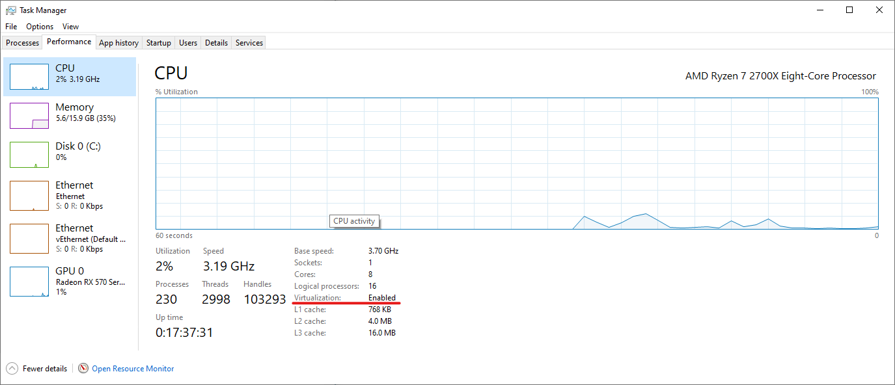
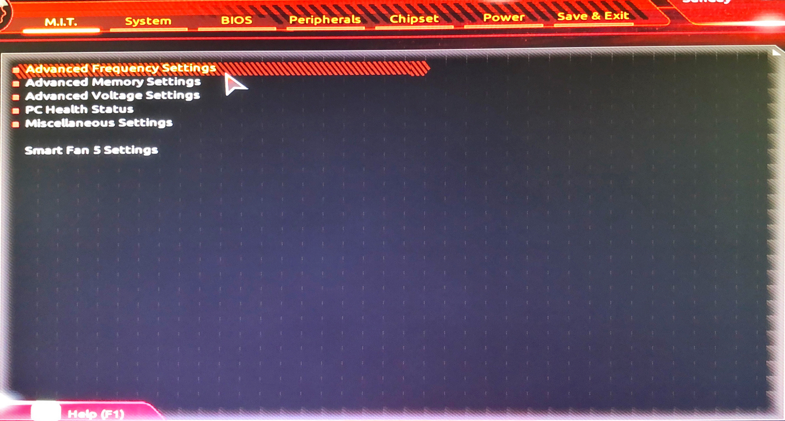
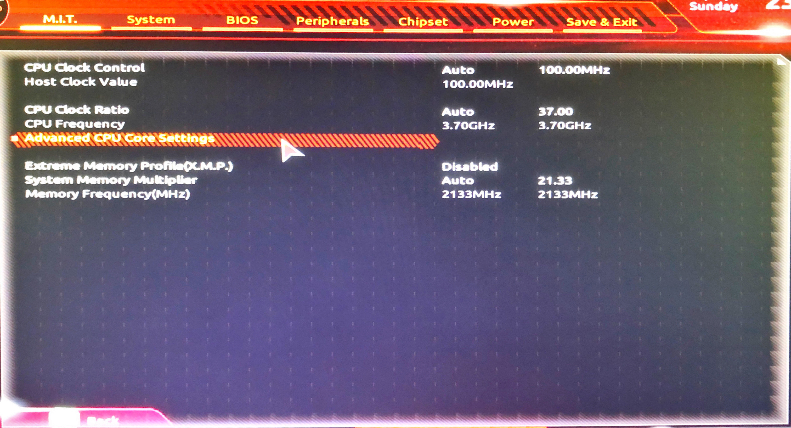
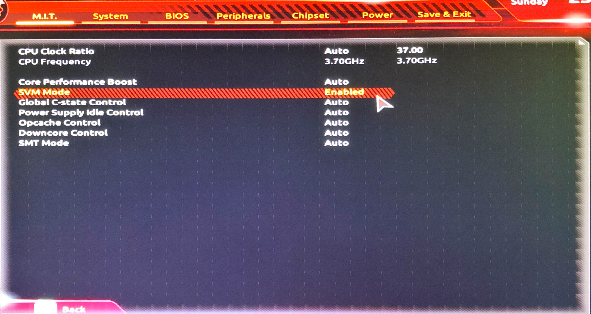

# AMD-Chip-on-Android-Studio
How to successfully create a virtual machine in Android Studio for users who have AMD CPUs. 

## About
Running Android Studio x86 on AMD Ryzen Processor using Microsoft Hyper-V
x86 Harware Accelerated Emulator is much more efficent than most other available images. 

## Prerequisites

Note: Android Stuio Canary is preferred, but not necessary. Android Studio now includes the previous stable and advanced installments of Canary.
- [Android Studio Canary 8 Build](https://developer.android.com/studio/preview) - Preview release for the latest features and improvements in Android Studio 11.

### Here are a list of steps to ensure that your machine is fully capable of running Virtualization.

- Check if Virtualization is enabled inside of our machine by navigating to the Task Manager, Performance, CPU, Virtualization: *Enabled*

- Use the provided image for guidance if needed.

- If Virtualization is not enabled then the next step is to enable it within the machine's BIOS.

For the purposes of demonstration, a Gigabyte motherboard would have the SVM (Support Vector Machine) hidden within M.I.T 

- Go to Advanced CPU Core Settings

- SVM Mode: Enabled

- Save & Exit Setup 

Should be all done! If steps were completed successfully, Android Studio Canary will now be supported by your CPU. If these steps still do not resovle the issue, know that some motherboards may be too old to suport Virtualization. In that scenario, I would encourage you to look at other posts on StackOverflow!

## Authors
* **Giancarlo Garcia**

